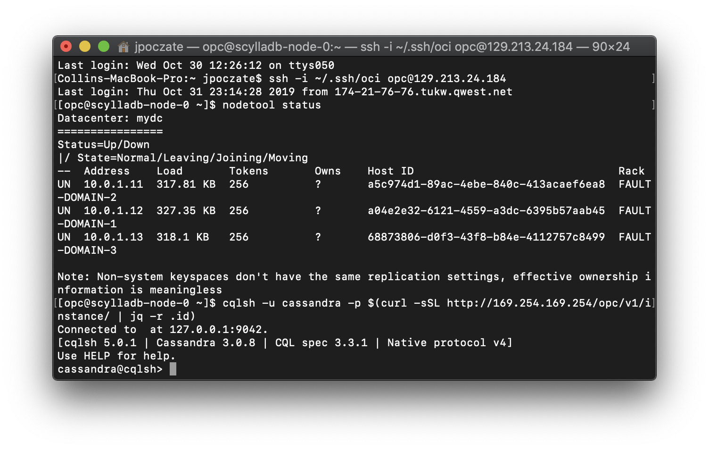
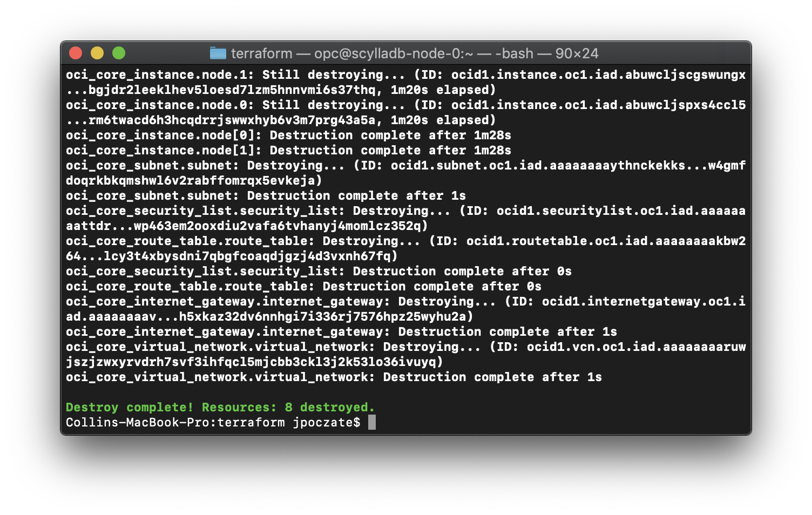

# oci-quickstart-scylladb

This is a Terraform module that deploys [ScyllaDB](https://www.scylladb.com/) on [Oracle Cloud Infrastructure (OCI)](https://cloud.oracle.com/en_US/cloud-infrastructure).  It is developed jointly by Oracle and ScyllaDB.

## Prerequisites
First off you'll need to do some pre deploy setup.  That's all detailed [here](https://github.com/oracle/oci-quickstart-prerequisites).

## Clone the Module
Now, you'll want a local copy of this repo by running:

```
git clone https://github.com/oracle/oci-quickstart-scylladb.git
cd oci-quickstart-scylladb/terraform/
ls
```

That should give you this:


We now need to initialize the directory with the module in it.  This makes the module aware of the OCI provider.  You can do this by running:

```
terraform init
```

This gives the following output:


## Deploy
Now for the main attraction.  Let's make sure the plan looks good:

```
terraform plan
```

That gives:


If that's good, we can go ahead and apply the deploy:

```
terraform apply
```

You'll need to enter `yes` when prompted.  The apply should take a few minutes to run.  Once complete, you'll see something like this:


## Access the Cluster
When the apply is complete, the infrastructure will be deployed, but cloud-init scripts will still be running.  Those will wrap up asynchronously.  So, it'll be a few more minutes before your cluster is accessible.

The output of `terraform apply` gives you the IPs of all nodes. If you ssh into one of the nodes, you can run `nodetool status` to see the state of all cluster nodes or `cqlsh` to execute CQL commands:



## Destroy the Deployment
When you no longer need the deployment, you can run this command to destroy it:

```
terraform destroy
```

You'll need to enter `yes` when prompted.  Once complete, you'll see something like this:


